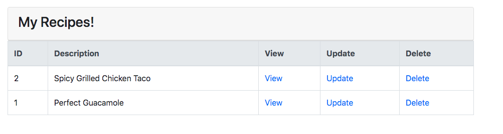

## Spring Boot Recipe Application

[](https://circleci.com/gh/fightinglinc/spring5-recipe-app)

Run the project in IDE or run this command and go to http://localhost:8080

```
./mvnw spring-boot:run
```

## Screenshot


